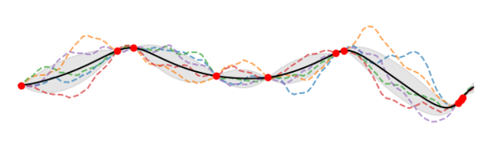
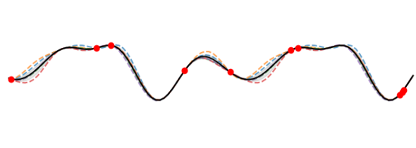

## 2.1. Definitions

This section aims provide a brief overview of GPs and to set out the notation for the following sections. For a more detailed and/or intuitive introduction to GPs, we refer the reader to the following resources:

* [A Visual Exploration of Gaussian Processes](https://distill.pub/2019/visual-exploration-gaussian-processes/) by Jochen Görtler, Rebecca Kehlbeck and Oliver Deussen
* [Gaussian Proccesses for Machine Learning](https://gaussianprocess.org/gpml/) by Rasmussen and Williams (2006).
* [Interactive Gaussian Process Visualization](http://www.infinitecuriosity.org/vizgp/) by ST John

### 2.1.1. GP regression

Consider the set of observations comprising input-output pairs $\{\bm{x}_i, y_i\}$ with $i=1,\dots, N$, $\bm{x}_i \in \mathbb{R}^D$, and $y_i \in \mathbb{R}$. These observations are generated by a function $f$, describing the relationship between inputs and outputs, and modulated by a noise term that accounts for the uncertainty in the observed data:

$$ y_i = f(\bm{x}_i) + \epsilon_{i}, $$

where $\epsilon_{i}$ is assumed to be distributed normally as $\mathcal{N}(0, \sigma_n^{2})$ with standard deviation $\sigma_n$. The latent function $f$ can be modelled with a Gaussian Process (GP) ([Rasmussen and William, 2006](https://gaussianprocess.org/gpml/)) . A GP is a stochastic process where any finite collection of its random variables is distributed according to a multivariate normal distribution. Generalising to infinity, a GP can be viewed as a distribution over functions. A GP is defined by a mean function $\mu(\bm{x})$ and covariance or kernel function $k(\bm{x}, \bm{x}^{\prime})$:

$$ f(\cdot) \sim \mathcal{GP}( \mu(\bm{x}; \bm{\theta}_\mu), k(\bm{x}, \bm{x}^{\prime}; \bm{\theta}_k)) $$

where both mean and kernel function typically depend on hyperparameters $\bm{\theta}_\mu$ and $\bm{\theta}_k $.

A standard method for learning the kernel hyperparameters is to maximise the marginal likelihood, the probability density of the observations given the hyperparameters. The marginal likelihood is computed by integrating over the values of $f$. Collecting inputs and outputs into $\bm{X} = (\bm{x}\_i)\_{i=1}^N$ and $\bm{Y} = (y\_i)\_{i=1}^N$, the logarithm of the marginal likelihood is given by

$$ \log (p(\bm{Y} \vert \bm{X}, \bm{\theta})) = -\frac{1}{2} (\bm{Y} - \bm{\mu})^{\top} (\bm{K}+\sigma_{n}^2 \bm{I})^{-1} (\bm{Y}-\bm{\mu}) $$

$$ - \frac{1}{2} \log (\vert \bm{K} + \sigma_{n}^{2} \bm{I} \vert) - \frac{N}{2} \log (2 \pi) , $$

where the mean vector $\bm{\mu}$ collects $(\mu(\bm{x}\_i))\_{i=1}^N$ and the kernel matrix $\bm{K}$ is constructed from $k(\bm{x}_i, \bm{x}_j)$ evaluated on all pairs $i,j = 1,\dots,N$.
The hyperparameters of mean and kernel function and of the likelihood ($\sigma_n^2$) are collected in the hyperparameter vector $\bm{\theta}$.

Maximising the log marginal likelihood w.r.t $\bm{\theta}$ then gives the Maximum Likelihood Estimate for the hyperparameter values. Assuming a Gaussian likelihood for $\bm{\epsilon}$, the posterior predictive distribution is tractable and can be used to calculate predictions for a new output $f_{\*}$, given a new input $\bm{x}_{\*}$, as

$$ p(f_*\vert \bm{Y},\bm{X},\bm{x}_*) = \mathcal{N}(f_*\vert \mu_*(\bm{x}_*), \sigma_{*}^2 (\bm{x}_*)).$$

Predictions are computed using the predictive mean $\mu\_{\*}$, while the uncertainty associated with these predictions is quantified through the predictive variance $\sigma_{*}^2$:

$$ \mu_*(\bm{x}_*) = \bm{k}_{*n}^{\top} (\bm{K}+ \sigma_n^2 \bm{I})^{-1} (\bm{y} - \bm{\mu}) + \mu(\bm{x}_*),$$

$$ \sigma_{*}^2 (\bm{x}_*) = k_{**} - \bm{k}_{*n}^{\top} (\bm{K} + \sigma_n^2 \bm{I})^{-1} \bm{k}_{*n},$$

where $\bm{k}\_{\*n} = [k(\bm{x}\_\*, \bm{x}\_1), \dots, k(\bm{x}\_\*, \bm{x}\_n)]^{\top}$ and $k\_{\*\*} = k(\bm{x}\_\*,\bm{x}\_\*)$.

### 2.1.2. Multi-task GP regression

Multi-task GP regression is a generalisation of GP regression where the observations for multiple dimensions are generated by a GP. The first multitask GP model was introduced by [Bonilla et al. (2008)](https://papers.nips.cc/paper_files/paper/2007/hash/66368270ffd51418ec58bd793f2d9b1b-Abstract.html). We will focus on this implementation which is well established in GP libraries, although other approaches to this problem exist.

 More formally, given a set $X$ of $N$ distinct inputs $x_1 , . . . , x_N$ we define the complete set of responses for $M$ tasks as $y=(y_{11},...,y_{N1},...,y_{12},...,y_{N2},...,y_{1M},...,y_{NM})^T$, where $y_{il}$ is the response for the $l$th task on the $i$th input $x_i$. Let us also denote the $N × M$ matrix $Y$ such that $\bm{y} = \text{vec} \ Y$ .

Given a set of observations $\bm{y}_o$, which is a subset of $\bm{y}$, we want to predict some of the unobserved response-values $\bm{y}_u$ at some input locations for certain tasks. We approach this problem by placing a GP prior over the latent functions $\{f_l\}$ so that we directly induce correlations between tasks. Assuming that the GPs have zero mean we set:

$$ ⟨f_l(\bm{x})f_k(\bm{x}')⟩ = K^{f}_{lk} k^x(\bm{x},\bm{x}') \quad y_{il} ∼ \mathcal{N}(f_l(x_i),σ_{l}^2),$$

where $K_f$ is a positive semi-definite (PSD) matrix that specifies the inter-task similarities, $k_x$ is a covariance function over inputs, and $σ_l^2$ is the noise variance for the lth task. Below we focus on stationary covariance functions $k^x$; hence, to avoid redundancy in the parametrization, we further let $k^x$ be only a correlation function (i.e. it is constrained to have unit variance), since the variance can be explained fully by $K_f$ .

### 2.1.3. GP classification

For binary classification, we have a discrete target variable $t∈0,1$ that follows a Bernoulli distribution. We are interested in the probability $p(t=1 \vert a)=σ(a)$ where $σ$ is the logistic sigmoid function taking logit $a∈ℝ$ as argument. $p(t=0 \vert a)$ is given by $1−p(t=1 \vert a)$. Given observed targets $\bm{t}$ at points $\bm{X}$, our goal is to predict target $t_∗$ at point $\bm{x}\_\*$ using the predictive distribution $p(t\_\*=1 \vert \bm{x}\_\*,\bm{X},\bm{t})$. Making the conditioning on input variables implicit, the notation of the predictive distribution simplifies to $p(t\_\*=1∣\bm{t})$.

The predictive distribution is given by:

$$ p(t_*=1 \vert \bm{t})=∫p(t_*=1 \vert a_*)p(a_∗ \vert \bm{t})da_∗$$

This integral is analytically intractable. Two approximation are needed:

1. First, $p(a_\* \vert \bm{t})$ must be approximated with a Gaussian distribution.
2. Second, $p(t_\*=1 \vert a_∗)=σ(a_\*)$ must be approximated with the inverse probit function $Φ(a_*)$

Let’s start with $p(a\_\* \vert t)$ which can be defined as:

$$ p(a_∗\vert \bm{t})=∫p(a_∗\vert\bm{a})p(\bm{a} \vert \bm{t})d\bm{a}$$

The first term inside the integral, $p(\bm{a}\_* \vert \bm{a})$, is a Gaussian distribution that can be obtained using a GP for regression. The joint distribution over logits $p(\bm{a}, a\_\* \vert \bm{X},\bm{x}\_\*)$ can be turned into a conditional distribution $p(a\_\*\vert \bm{x}\_\*,\bm{X},\bm{a})$. Making the conditioning on input variables implicit gives $p(a\_\*\vert\bm{a})$.

Using the Laplace approximation, the posterior distribution $p(a∣t)$ can be approximated with a Gaussian distribution $q(a)$:

$$ q(\bm{a})=\mathcal{N} (\bm{a}\vert\hat{\bm{a}} ,\bm{H}^{−1})$$

where $\bm{H} = \bm{W} +(\bm{K} + \sigma_a^2 \bm{I})^{−1}$. $W$ is a diagonal matrix with elements $σ(a_n)(1−σ(a_n))$ with an being the elements of $\bm{a}$. Written in vector notation the diagonal is $\bm{σ}(1−\bm{σ})$.

The mean $\hat{\bm{a}}$ can be obtained iteratively with the following update equation:

$$a^{\text{new}} = \bm{K}_a(\bm{I}+\bm{W}\bm{K}_a)−1(\bm{t}−\bm{σ}+W \bm{a})$$

where $$ \bm{K}_a = \bm{K} + \sigma_a^2 \bm{I}$$. At convergence $\hat{\bm{a}} = \bm{a}^\text{new}$.

With two Gaussians inside the integral, the result is also a Gaussian and can be obtained analytically. The Gaussian approximation of $p(a_* \vert t)$ is therefore given by:

$$ p(a_*\vert \bm{t})≈\mathcal{N}(a_* \vert μ_{a∗},σ^2_{a∗})$$

with

$$ μ_{a∗}=\bm{k}^\top_∗(\bm{t}−\bm{σ}) $$

$$ σ^2_{a∗} = k_{∗∗}−\bm{k}^\top_∗(\bm{W}^{-1}+\bm{K}_a)^{−1} \bm{k}_∗ $$

Finally, we approximate $p(t_*=1 \vert a_*)$ with the inverse probit function $Φ(a_*)$ so that the predictive distribution can be approximated with:

$$ p(t_∗=1 \vert \bm{t})≈ σ(μ_{a∗}(1+ πσ^2_{a*}/8)^{−1/2})$$

---

## 2.2. Strengths and limitations

### 2.2.1. Strengths

GPs have a number of advantages that can make them a judicious choice over other supervised machine learning algorithms. A GP provides:

* __Well-calibrated uncertainty estimates__. Assuming the specified model is appropriate, a GP ‘knows when it does not know’, increasing the uncertainty away from the training distribution. This is useful for determining the likelihood of extreme events and improving decision making.

* __Machine learning for correlated datasets__. In many cases such as geospatial problems, neighbouring observations are usually not independent and identically distributed (i.i.d.) but closely correlated to one another ([Lalchand et al., 2022](https://arxiv.org/abs/2209.04947); [Bhatt et al.,2017](https://royalsocietypublishing.org/doi/10.1098/rsif.2017.0520)).

* __More interpretable machine learning__. Although not as interpretable as simpler methods such as conventional linear regression or random forests, GP covariance functions specify high-level properties of the generated functions which can be conveyed in natural language ([Lloyd et al., 2014](https://ojs.aaai.org/index.php/AAAI/article/view/8904)). Compared to deep learning methods, with thousands to trillions of learnable parameters which cannot obviously be linked with given physical features of the model predictions, GPs can be a more trustworthy alternative to the model end users.

* __Data-efficient machine learning__. A GP is a non-parametric Bayesian method which provides both model expressivity while avoiding overfitting. GPs adapt to different datasets and handle data efficiently without requiring a predefined model structure. Furthermore, once a GP model is trained, new data points can be incorporated efficiently without retraining ([Bui et al., 2017](https://proceedings.neurips.cc/paper/2017/hash/f31b20466ae89669f9741e047487eb37-Abstract.html); [Chang et al., 2023](https://proceedings.mlr.press/v202/chang23a.html)).

* __Machine learning systems__. GP regression is unlikely to fail and can be used reliably as a subpart of a bigger machine learning system, for example in probabilistic numerics ([Hennig et al., 2022](https://www.probabilistic-numerics.org/textbooks/)), reinforcement learning ([Engel  et al., 2005](https://icml.cc/Conferences/2005/proceedings/papers/026_Reinforcement_EngelEtAl.pdf)) and automated statisticians (see [Section](/framework/3_related_work.md)).

### 2.2.2. Limitations

It is also important to acknowledge the limitations of GPs. They struggle with:

* __Large numbers of datapoints__. Training on datasets with $N \gtrsim 10^{4}$ becomes prohibitive ([Deisenroth and Ng., 2015](https://arxiv.org/abs/1502.02843); [Wang et al., 2019](https://arxiv.org/abs/1903.08114)). The computational complexity of covariance matrix inversion in the calculation of the log marginal likelihood and the predictions scales as $\mathcal{O}(N^3)$ ($\mathcal{O}(N^{3}M)$ for multitask regression). The memory for storing the matrices scales as $\mathcal{O}(N^2)$.

* __High-dimensional input spaces__. raining on datasets with $D \gtrsim 100$ becomes difficult due to the need to compute pair-wise elements of covariance function which scales as $\mathcal{O}(DN^2)$, e.g. they are not best-suited to images ([van der Wilk et al., 2017](https://papers.nips.cc/paper_files/paper/2017/hash/1c54985e4f95b7819ca0357c0cb9a09f-Abstract.html)).

* __Complex covariance functions__. In situations which require covariance functions with many parameters that must be learned from the data, the covariance function will be hard to design and the model may overfit ([Ober et al., 2021](https://proceedings.mlr.press/v161/ober21a.html)).

* __Non-Gaussian distributions__. While Gaussian prior and likelihood function assumptions are quite common in classical scientific computing techniques, modern models, such as deep generative models, are increasingly moving towards modelling the target prior/posterior distributions using more flexible distributions parameterised by deep neural networks, like normalising flows ([Korshunova et al., 2018](https://arxiv.org/abs/1802.07535); [Casale et al., 2018](https://arxiv.org/abs/1810.11738)). These models avoid explicit handcrafted assumptions about the data or model and enable less biased Bayesian inference.

* __Misspecified model__. Here, misspecification refers to our belief, or lack thereof, in the proposed model to accurately represent the underlying patterns present in the data. In this case it is hard for the model to generate accurate results. For example, an inappropriate kernel function could be chosen for the covariance matrix (see Figure 2.1). Poorly specified models will not only produce a more inaccurate mean posterior distribution but also inaccurate confidence intervals and inappropriate samples ([Sollich,2001](https://arxiv.org/abs/cond-mat/0106475), [Sollich, 2004](https://link.springer.com/chapter/10.1007/11559887_12), [Brynjarsdottir et al., 2014](https://iopscience.iop.org/article/10.1088/0266-5611/30/11/114007)).

  
  

*Figure 2.1: GP fit for 10 data points sampled from the periodic function $\sin^2(x - 2.5)$ using a Matérn 3/2 kernel (top) and a periodic kernel (bottom). Although the mean posterior distributions are similar, the shape of the samples and confidence intervals are different. Adapted from [Scikit Learn, 2023](https://scikit-learn.org/stable/modules/gaussian_process.html).*
