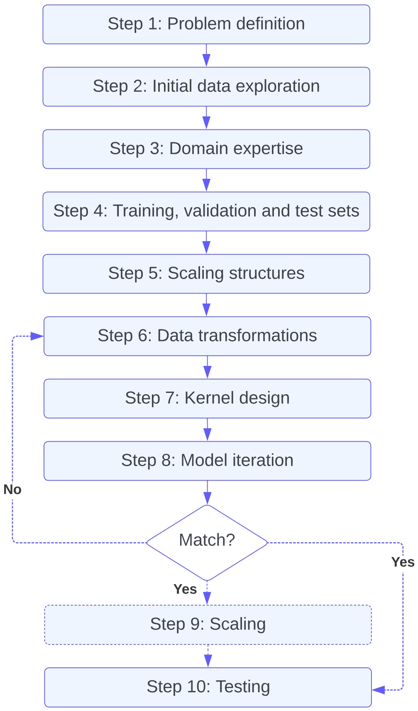

  

## Step 1: Problem definition

As in any data science problem, the first step is to define the task at hand. What kind of predictions would we like to make? Will the model interpolate or extrapolate the training data? What should the model output be (e.g.~a report, one model, an ensemble of models, a forecast, a de-noised timeseries)? Is the output conditional on other variables? For example, the time for a PhD to travel to the Engineering Department will depend on their start location, their mode of transport, the time of day and the time until their thesis submission. In particular, it is important to distinguish between different types of regression. Typically, problems are defined as in [Section 2](2_gp_definition.md) but they could also be posed as an auto-regressive task:
$$ y_t = f(y_{t-1})+ \epsilon_t $$
where $y$ at the variable $t-1$ is used to predict the observation of $y$ at the next $t$. This setup is common for emulation problems where the modeller is interested in replicating the behaviour of a system that is expensive or difficult to study in real life. The type of task which the modeller solves will determine how they design the model(s). For example, forecasting a single time-series along time in the future would mean we want to concentrate on incorporating long term dependencies present in the data. The task also shapes the metrics that should be used at validation and test time: do we care about modelling uncertainties, the mean or the extremes?

## Step 2: Initial data exploration

The next step is to perform an initial exploration of the data in order to understand whether it is suitable for GP regression. One should consider:

* Number of data points $N$. For $N > 10^4-10^5$, exact GP computation becomes prohibitively expensive ([Deisenroth and Ng., 2015](https://arxiv.org/abs/1502.02843); [Wang et al., 2019](https://arxiv.org/abs/1903.08114)). $N < 100$ may be too small especially in the case of a complex kernel with many hyperparameters which can lead to overfitting. Smaller $N$ can be mitigated using Markov Chain Monte Carlo (MCMC) estimation ([McNeish et al., 2016](https://www.google.com/url?sa=t&rct=j&q=&esrc=s&source=web&cd=&ved=2ahUKEwj6mcz6_5OCAxVmUUEAHcHnBToQFnoECBYQAQ&url=https%3A%2F%2Fwww.tandfonline.com%2Fdoi%2Fabs%2F10.1080%2F10705511.2016.1186549&usg=AOvVaw0ZidbH7fi2dLBxWTPctuIB&opi=89978449)).
* Number of input dimensions $D$. GPs are not immune to the curse of dimensionality. For $D > 10$, it is hard for the modeller to form a clear image of the problem. It can therefore also be difficult to design an appropriate kernel. The number of parameters used to define the kernel will also increase, meaning it will be easier to overfit. Furthermore, if $D$ is very large $D>100$, constructing the covariance matrix, which scales as $\mathcal{O}(N^2D)$, can become a computational bottleneck.
* Output requirements. Are probability distributions needed for this task? If the modeller simply requires the mean output an alternative method may be more appropriate.

Further considerations:

* We propose a range of values for the upper limit of $N$. This is because the limit will depend on how the model is used. Higher $N$ can be used for one-off modelling rather than learning hyperparameters through repeated likelihood evaluation.
* Above these limits, it is worth considering the use of a GP as a wrapper for a deep learning model ([Sun et al., 2022](https://hess.copernicus.org/articles/26/5163/2022/hess-26-5163-2022.html)). In this case, a deep learning model can be trained on a large subset of the data. The inputs to the GP can be the output from the deep learning model or their residuals. The GP could also be used to refine the predictions for specific locations in the input feature space using held-out data. This will then yield uncertainties which can be used for uncertainty quantification, active learning, etc.. $^{\dagger}$
* It may be acceptable to work in the top end of the dimension range if only a few dimensions are doing most of the predictive work. Furthermore, it is also possible to select or generate a set of lower dimensional features to feed into the model using decision trees such as Random Forests or dimensionality reduction methods such as Principal Component Analysi ([Binois and Wycoff, 2022](https://arxiv.org/abs/2111.05040)).
* For large datasets (see Step 5), two approaches are possible. In the first case, the data can be divided into chunks, independent GPs or `GP experts' applied are then to each part and predictions are made using a (robust) Bayesian Committee Machine ([Tresp, 2000](https://www.dbs.ifi.lmu.de/~tresp/papers/bcm6.pdf); [Deisenroth and Ng, 2015](https://arxiv.org/abs/1502.02843)}. In the second case and conditional on specific structure, scaling GP methods can be also applied.

$^{\dagger}$ If the models are not trained jointly, the procedure will result in overfitting and the residuals will go to zero with the GP collapsing to 0 uncertainty. If the GP is fit on the training data (and not the just the held-out data) using a neural network will be more likely to result in overfitting since the model might fit the data perfectly even before applying the GP.

## Step 3: Domain expertise

In this step, the modeller maps out the information that is known about the dataset, prior to a more in-depth analysis. Writing out this information in detail will be key in designing an appropriate kernel with priors and constraints in Step 7. For example, a positive constraint is necessary when modelling rainfall.

## Step 4: Training, validation and test set definition

A held out dataset allows the modeller to check whether they are under or overfitting, and to give some indication of the performance they would get on `real' unseen data. The separation of the data should reflect the goals and the performance they want to measure in Step 1, and information from Step 3. Ideally the dataset should be separated into three groups: a training set, a validation set, and a test set which will not be iterated over. In many cases, the data is used in real-world is not i.i.d., it is dependent and  correlated, and come from heterogeneous sources and samplings regimes. If the effective number of data points (the number of independent samples that would be needed to produce the same information content as the given sample) is fairly small, then a cross-validation scheme is strongly recommended to assess the stability and predictability of the model ([Yu and Kumbier, 2020](https://arxiv.org/abs/1901.08152)).

## Step 5: Scaling structures

When working with a large dataset, the modeller should also analyse the training data to find structure that may lead to the application of scaling methods. Three cases and how to identify them are discussed below.

* __Case 1__: Oversampled functions. An oversampled function is sampled more frequently than is required to capture its underlying structure and variation. In the case of a periodic function this would be more than the Nyquist frequency. In this situation, the modeller can use sparse GP regression with variational inference of inducing points ([Titsias, 2009](https://proceedings.mlr.press/v5/titsias09a.html)). Many GP libraries, such [`GPflow`](https://gpflow.org) or [`GPyTorch`](https://gpytorch.ai), offer built-in functions to perform this approximation.
* __Case 2__: Timeseries data. For timeseries data, the GP can be mapped to a Stochastic Differential Equation (SDE) ([Hartikainen, 2010](https://ieeexplore.ieee.org/document/5589113)). This approximation has a linear cost in the number of time points and works well in many situations. However the mapping between the covariance matrix and the SDE can be expensive, sometimes more expensive than solving SDE itself. [`TemporalGPs.jl`](https://github.com/JuliaGaussianProcesses/TemporalGPs.jl), a package Julia, provides a framework to apply this method.
* __Case 3__: Kronecker product structure. For such dataset with the following kernel structure, such as gridded data:

    $$\text{Cov}\biggl(\begin{bmatrix} x_1 \\ x_2  \end{bmatrix} \begin{bmatrix} x_1^{\prime} \\ x_2^{\prime}\end{bmatrix} \biggl)=\text{Cov}(x_1,x_1^{\prime} )\otimes \text{Cov}(x_2,x_2^{\prime}),$$

    the Kronecker identity can be used to invert the matrices in a piecewise fashion ([Saatcci et al., 2012](https://mlg.eng.cam.ac.uk/pub/pdf/Saa11.pdf)). This trick is used in the Structured Kernel interpolation (SKI) ([Wilson and Nickish, 2015](https://proceedings.mlr.press/v37/wilson15.html)). Both SKI and SKIP are implementable in [`GPyTorch`](https://gpytorch.ai).

If no structure is apparent, a baseline that is hard to beat is to the divide the data into smaller datasets, as previously mentioned. This can be done naively by separating data chronologically or into tiles. However, it can be useful to make use of clustering algorithms, such as k-means or k-nearest neighbours, to group features that exhibit similar properties.

## Step 6: Data transformations

To improve inference, input features should generally be z-scored, i.e., subtracting the mean and dividing by the standard deviation. This means that most values should lie between -1 and 1. Exact GPs also expect the posterior distribution to be Gaussian. Applying a transformation to the target data, i.e.~the marginal likelihood, can help achieve this. Transforms also can help avoid unphysical predictions such as negative values and highlight the areas of the distribution we would like to predict more accurately. Some common transformations are logarithm and power functions such as the Box-Cox transformation ([Box et al, 1964](https://rss.onlinelibrary.wiley.com/doi/10.1111/j.2517-6161.1964.tb00553.x)). These transformation will constrain values to be non-zero but also reduce the weighting of the extreme values. Transformations also have a significant effect on the confidence interval of the model. The modeller should check the training data residuals and samples iterating over the chosen transform if necessary. It can be helpful to check if the transformation improves baselines such as linear regression or k-nearest neighbour models.

## Step 7: Kernel design

In this step, the modeller explores the dataset in order to design the kernel function. To compose a kernel, the following characteristics of the target variable should be considered: smoothness, lengthscales, periodicity, outliers and tails, asymmetry, and stationarity. Tools such as first and second order statistics, scatter plots (with low dimensional projections), covariance and correlation matrices, autocorrelation plots, power density spectrum, and k-Nearest Neighbour analysis can be used to find these properties. The modeller should exercise their common sense when applying these tests keeping in mind the task they are trying to solve, as defined in Step 1. They should also view this exercise as hypothesis testing and ascertain if the characteristics of the dataset match the domain knowledge, outlined in Step 3, and if not, why.

This step is also important for inference time. The covariance is inverted analytically and, in most cases, Cholesky decomposition is used. However, this method requires the covariance matrix is Hermitian positive definite. This means the decomposition will fail if the one of the input dimensions is linearly related to another or a combination of other inputs. In practice, many GP models are set to have a zero mean function $\mu(\bm{x})$. However, the stability of inference can also be improved by modelling the most obvious features of the dataset through $\mu(\bm{x})$ the rather than $k(\bm{x}-\bm{x}^{\prime})$.

Now that we have a clear understanding of the data. We can design the kernel function through `kernel composition'. The kernel can be built by combining standard operators and base kernel functions \citep{duvenaud2014construction}. Adding is equivalent to applying the logical operator ‘OR’, i.e.~changes in the amplitude can be explained by either term in the sum. For example, the resulting kernel will have high value if either of the two base kernels have a high value. Multiplying is similar to an ‘AND’ operation, i.e.~changes in the amplitude are explained by both term in the multiplication. For example, the kernel will have high value if both base kernels have a high value. It's worth noting that multiplying kernels can result in a lower-dimensional representation of the data, simplify eigenvalue decomposition, result in a sparse matrix, and allow for pre-computation, thus making this procedure a computationally efficient way to combine with kernels. The design of the kernel will first and foremost affect the smoothness of the samples. The modeller can enforce this by choosing the smoothness of the mean and covariance functions. This is in particular useful for modeling data with underlying structures, such as financial time series data or image data.

If the model does not initially converge close the lengthscales values determined previously. They can be initialised manually. If this still does not change where the model converges, strong guidance can be applied through constraints and priors. In real-world cases, including such specifications are not uncommon to achieve the desired results. These include:

* __Boundary constraints__. The modeller enforce boundary constraints on the model parameters, such as bounds on the mean function parameters or variance and lengthscale of the kernel function. This can be useful when modeling physical processes that have known limits or constraints. In practice, using constraints may be difficult. If they do not match the observations, the model can break down. It is usually better to have small and positive priors (see next point).
* __Bayesian priors__. The model incorporate prior knowledge about the parameters of the model using priors distributions. For example, a Gaussian prior can be placed on the parameters of the covariance function to encourage the model to converge to a particular solution.
* __Constraints on the covariance function__. The modeller can enforce constraints on the covariance function, such as stationarity or monotonicity. These constraints can help to ensure that the model has physically meaningful properties.

Note that kernels with many hyperparameters will be more likely to overfit the data. Furthermore, recent literature suggests that even when a large number of terms are used, only a few parameters drive the outputs of the model after inference ([Lu, Boukouvalas and Hensman, 2022](https://proceedings.mlr.press/v162/lu22b.html)). Regularisation techniques can be applied to the kernel function to limit overfitting ([Cawley and Talbot, 2007](https://www.jmlr.org/papers/v8/cawley07a.html)) but are usually quite involved to put in place. %The kernels could also be modified put more emphasis on different parts of the marginal distribution such as extremes.

## Step 8: Model iteration

The modeller should start by setting up some simple non-GP baseline such as k-NN or linear regression. They should then build the kernel iteratively, trying the most important dimensions first and check the physical consistency of the samples, the structure of residuals, the posterior predictive likelihood scores such as the marginal log likelihood, the mean log loss and Bayesian Information Criterion. The bias, Root Mean Square Error (RMSE) and Mean Absolute Error should also be evaluated. The checks should be repeated at for each iteration on both the training and validation sets. The modeller should keep iterating, until the scores start to stagnate or signs of overfitting are observed. If they are using using the GP for interpolation, this can simply be done by comparing the metrics such as RMSE and log-likelihood for the training and validation sets. However if extrapolation is the goal, it is normal for the model to perform worse away from the training distribution. In this case, it is useful to look at the GP samples. Are they sensible for both the training and validation sets?

GP samples can also be used as `synthetic data' to check the validity of the model and training procedure. The synthetic data is generated from the model samples. This fake data is similar to real data, but where ground truth parameter values are known. The samples can be fit using another GP. If the specified model is doing a good job, the modeller should be able to recover the original covariance matrix of the training data. If the results of these tests are unsatisfactory, return to Step 6 and try a new transformation design or set of constraints.

If after performing Steps 6 to 8, there is no significant improvement, more involved ‘research grade’ GP methods such as a Deep Gaussian Process ([Damianou and Lawrence, 2013](https://proceedings.mlr.press/v31/damianou13a.html)) or a Gaussian Process Latent Variable Model ([Titsias and Lawrence, 2010](https://proceedings.mlr.press/v9/titsias10a)) may be more suitable for the problem.

## Step 9: Scaling

If the modeller is using a large dataset, they can now apply their findings from Step 5. In particular, they will either apply one of the previously discussed scaling methods or apply independent GPs to chunked data to make predictions using a Bayesian Committee Machine. This can be implemented using the [`guepard`](https://github.com/NicolasDurrande/guepard) library.

## Step 10: Testing

Finally check the model on the test data using the same metrics as outlined in Step 8. These are the values that should be quoted as the results.
